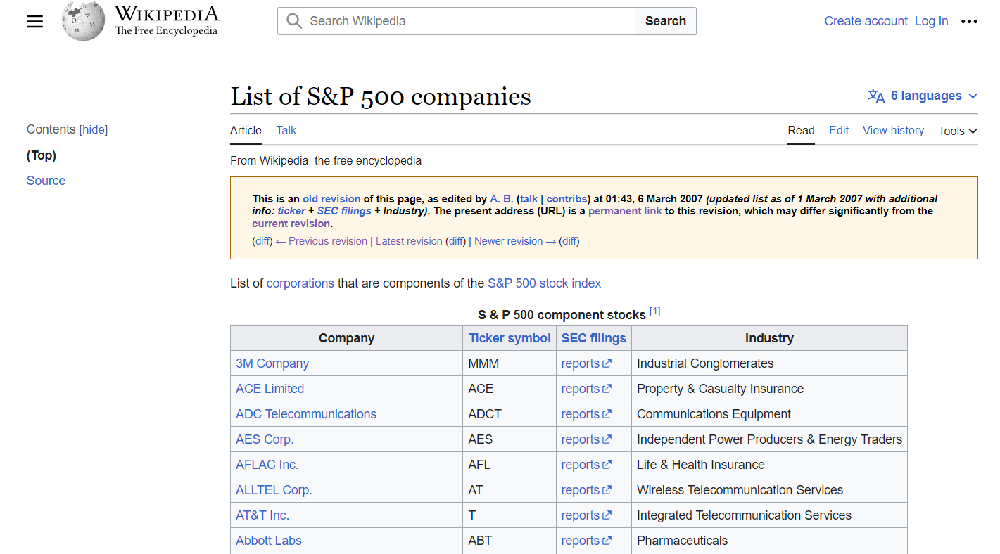

  
```{r setup, include=FALSE, echo=FALSE}
knitr::opts_chunk$set(echo=TRUE, error=FALSE, message=FALSE, warning=FALSE, out.width="150%", dpi=200)
```

```{r, out.height = "350px"}

```

# Introduction

This R Markdown document analyzes the performance of stocks that fell sharply from the S&P 500 index. It looks at stocks that dropped 80% or more over a four year period after three reference dates:

- January 1, 1999
- March 1, 2007
- March 15, 2015

It then compares the stock performance of the fallen stocks over the subsequent four years to the performance of the overall S&P 500 index in the same period.

# Preparations

First relevant packages are loaded and the reference dates are set. The three dates were chosen based on practical thoughts. It is quite hard to get historical S&P 500 constituents for free. The best way I found was to use the Versioning of Wikipedia, which allows to retrieve historical versions of the Wikipedia page listing S&P 500 constituents back to 2007 (see screenshot below). To get older data than 2007, the current constituents were used on the S&P 500 wikipedia page as basis as well as a table listing all index changes from 1990 on the same page. The changes dataframe allows reconstituting the constituent list on any date by iteratively stepping backwards and applying changes. This method is quite error prone though! The S&P 500 index constituents change frequently due to various reasons like mergers, acquisitions, bankruptcies etc. Tracking all these changes accurately over a long period can be challenging.

```{r Preparations}
# Load packages
library(httr) # Used for GET function
library(XML) # Used to read HTML Table
library(tidyverse)# Used for data manipulation
library(janitor) # Used to make clean names
library(lubridate) # Used to extract year and month from dates
library(tidyquant) # Used to get financial data into r as well as for saving prices in tidy format(tibble)
library(here) # Used to navigate easy to folder of r script
library(ggpubr) # Used for lolipop chart
library(lubridate) # Used to add months to dates even if it is a date from a leap year (29th february)
library(patchwork) # Used to wrap plots
library(skimr) # Used to get fist overview of dataset
library(magick) # Used to read image
library(grid) # Used to render an image at plot


# Set target dates 
Target_Date_1999 <- "1999-01-01" 
Target_Date_2007 <- "2007-03-01"
Target_Date_2015 <- "2015-03-15"

# set color palette
stock_comp <- c("#ff6961", "#779ecb")
```

<br>
<center>
{width=100%}
</center>
<br>
*6 March 2007 revision of the List of S&P 500 companies wikipedia page*

# Methodology

As indicated above, the goal of this analysis is to compare performance of stocks of the S&P 500 after they dropped hugely (80% or more) with the overall S&P 500 performance over a period of four years. This comparison should give hints if there might be something like a risk-bias, resulting in investors avoiding stocks right after a huge drop. This avoidance could lead to an overperformance of the fallen stocks in the following years, if the market was overestimating the risks of the stock. 

A comparison period of four years after the drop was used for this purpose. The methodology used to identify fallen stocks and evaluate performance is illustrated in the chart below on the example of the stock of GameStop Corp. It can be best described in three steps:

- Step 1 - Search Max: The maximum in the two years before Target Date is identified. This is necessary to identify stocks that dropped.

- Step 2 - Search 80% Drop: Next we search  for a drop of 80% or more from this initial maximum at any point in the next four years. If a new maximum is reached before the stock drops by 80%, this value is saved as the new maximum.

- Step 3 - Performance Evaluation: For stocks meeting this criteria, the close price right after the drop is tracked and again four years later. The difference in stock price is compared to the S&P 500 development over the same time.

```{r Methodology, , fig.height=8}
# Create values to show methodology with an example ticker
target_date <- as.Date("2015-03-15")
final_date <- as.Date("2023-01-30")
max_date <- as.Date("2013-11-13")
drop_date <- as.Date("2019-01-29")

# GME is used as example, stock prices for relevant time period are load
gme_stock_data <- tq_get("GME",
                       from = target_date-years(2),
                       to = final_date ,
                       get = "stock.prices")

close_max_date = gme_stock_data$close[gme_stock_data$date == max_date]
close_drop_date = gme_stock_data$close[gme_stock_data$date == drop_date] 

# read image for plot
gme_image = image_read("GameStop.png")
g <- rasterGrob(gme_image, interpolate=TRUE)

create_gme_stock <- function(df){
  ggplot(df, aes(date, close)) +
          theme_classic() +
          labs(x = '', y = "") +
          ylim(0, 110) +
          # Add line representing target_date
          geom_segment(x = target_date, xend = target_date , y = -Inf, yend = 100, linetype = "dashed") +
          # Add annotation label for target_date
          annotate("text", x = target_date, y = 108, label = "Target Date") +
          # Add gme symbol
          annotation_custom(g, xmin= final_date-months(18) , xmax= final_date-months(7), ymin=-Inf, ymax=12) 
}

p1 <- create_gme_stock(gme_stock_data) +
          labs(title = "Step 1 - \nSearch Max") +
          # Change background color
          geom_rect(aes(xmin = target_date-years(2), xmax = target_date, ymin = -Inf, ymax = 100), fill = "#d3d3d3", alpha = 0.014) +
          # Add search range arrow
          geom_segment(aes(x = target_date-years(2), y = 50, xend = target_date, yend = 50), arrow = arrow(length = unit(2, "mm"), ends = "both")) +
          # Add annotation label for search range
          annotate("text", x = target_date-years(1), y = 60, label = "Search Range") +
          geom_line() 
  
  
p2 <- create_gme_stock(gme_stock_data) +
          labs(title = "Step 2 - \nSearch 80% Drop") +
          # Add line representing max_date
          geom_segment(x = max_date, xend = max_date , y = close_max_date, yend = close_max_date *0.2, color = "red", linetype = "dashed") +
          # Add annotation label for max_date
          annotate("text", x = max_date, y = close_max_date + 10, label = "Initial Max", color = "red") +
          # Change background color
          geom_rect(aes(xmin = target_date, xmax = target_date+years(4), ymin = -Inf, ymax = 100), fill = "#d3d3d3", alpha = 0.014) +
          # Add search range arrow
          geom_segment(aes(x = target_date, y = 50, xend = target_date+years(4), yend = 50), arrow = arrow(length = unit(2, "mm"), ends = "both")) +
          # Add annotation label for search range
          annotate("text", x = target_date+years(2), y = 60, label = "Search Range") +
          # Add line represting y size of 80% drop
          geom_segment(x = max_date, xend = target_date+years(4) , y = close_max_date *0.2, yend = close_max_date *0.2, color = "red", linetype = "dashed") +
          geom_line()

  
p3 <- create_gme_stock(gme_stock_data) +
          labs(title = "Step 3 - \nPerformance Evaluation") +
          # Add annotation label and line for max_date
          annotate("text", x = max_date, y = close_max_date + 10, label = "Initial Max", color = "red") +
          geom_segment(x = max_date, xend = max_date , y = close_max_date, yend = close_max_date *0.2, color = "red", linetype = "dashed") +
          # Add line represting y size of 80% drop
          geom_segment(x = max_date, xend = target_date+years(4) , y = close_max_date *0.2, yend = close_max_date *0.2, color = "red", linetype = "dashed") +
          # Add lines representing drop_date and final_date
          geom_segment(x = drop_date, xend = drop_date , y = -Inf, yend = 100, color = "red") +
          geom_segment(x = final_date, xend = final_date , y = -Inf, yend = 100, color = "red") +
          # Add annotation labels
          annotate("text", x = drop_date, y = 108, label = "Drop Date", color = "red") +
          annotate("text", x = final_date-days(40), y = 108, label = "Final Date", color = "red") +
          # Change background color
          geom_rect(aes(xmin = drop_date, xmax = final_date, ymin = -Inf, ymax = 100), fill = "#d3d3d3", alpha = 0.014) +
          # Add search range arrow
          geom_segment(aes(x = drop_date, y = 50, xend = final_date, yend = 50), arrow = arrow(length = unit(2, "mm"), ends = "both")) +
          # Add annotation label for search range
          annotate("text", x = drop_date+years(2), y = 60, label = "Evaluation Period") +
          #  Add gme symbol again so it is full color
          annotation_custom(g, xmin= final_date-months(18) , xmax= final_date-months(7), ymin=-Inf, ymax=12) +
          geom_line()


wrap_plots(p1,p2,p3, ncol = 1)

  
```


# Get S&P 500 Constituents {.tabset}

We will start with getting the S&P 500 constituents from Wikipedia. We construct datasets with constituents at different points in time based on recorded changes (1999) or Wikipedia Versioning (2007 and 2015). The tickers from the constituents are then used to get historical stock data for each ticker. 

## 2015

The constituents as of March 15, 2015 were obtained by web scraping a historical version of the Wikipedia page from November 5, 2015. This allowed accessing a snapshot of the page before subsequent edits changed the constituent data. The archived URL including the exact date was:

https://en.wikipedia.org/w/index.php?title=List_of_S%26P_500_companies&oldid=652781827

While not guaranteed to be fully accurate, this provided a close approximation of the actual S&P 500 components as of March 15, 2015 for the analysis.

```{r Get 2015 constituents}
# Make connection to page
url <- "https://en.wikipedia.org/w/index.php?title=List_of_S%26P_500_companies&oldid=652781827"
r <- GET(url)

# Load table data 
sp500_2015 <- readHTMLTable(
      doc=content(r, "text"),
      header = TRUE) [[1]][,1:4]
names(sp500_2015) <- c("Ticker", "Name", "filings", "industry") 
      
# Get historical stock price data for the S&P500 constituents from 2015 using tidyquant     
stock_data_2015_constituents <- tq_get(unique(sp500_2015$Ticker),
                                  from = paste0(year(Target_Date_2015)-2,"-01-01"),
                                  to = paste0(year(Target_Date_2015)+8,"-12-31"),
                                  get = "stock.prices")

# Join the constituent data with the stock price data
sp500_2015 <- sp500_2015 %>%
                left_join(stock_data_2015_constituents, join_by(Ticker == symbol)) %>%
                filter(volume > 0)

# Get overview over combined dataset
sp500_2015 %>% skim()
```

Notes:

- It was only possible to get stock data for `r length(unique(sp500_2015$Ticker))` Tickers in the S&P 500 dataset from 2015. This shows a big limitation in the current method, as the tickers provided by Wikipedia are in the form of "MMM". They don't provide a stock exchange prefix and can also change over time. 

## 2007

The constituents as of March 1, 2007 were obtained by web scraping a historical version of the Wikipedia page from March 5, 2007. This allowed accessing a snapshot of the page before subsequent edits changed the constituent data. The archived URL including the exact date was:

https://en.wikipedia.org/w/index.php?title=List_of_S%26P_500_companies&direction=next&oldid=112162478

While not guaranteed to be fully accurate, this provided a close approximation of the actual S&P 500 components as of March 1, 2007 for the analysis.

```{r Get 2007 constituents}
# Make connection to page
url <- "https://en.wikipedia.org/w/index.php?title=List_of_S%26P_500_companies&direction=next&oldid=112162478"
r <- GET(url)
# Load table data 
sp500_2007 <- readHTMLTable(
      doc=content(r, "text"),
      header = TRUE) [[1]][,1:4]
names(sp500_2007) <- c("Name", "Ticker", "filings", "industry") 

# Get historical stock price data for the S&P500 constituents from 2007 using tidyquant        
stock_data_2007_constituents <- tq_get(unique(sp500_2007$Ticker),
                                  from = paste0(year(Target_Date_2007)-2,"-01-01"),
                                  to = paste0(year(Target_Date_2007)+8,"-12-31"),
                                  get = "stock.prices")


# Join the constituent data with the stock price data
sp500_2007 <- sp500_2007 %>% 
                left_join(stock_data_2007_constituents, join_by(Ticker == symbol)) %>%
                filter(volume > 0)

# Get overview over combined dataset
sp500_2007 %>% skim()
```

Notes:

- It was only possible to get stock data for `r length(unique(sp500_2007$Ticker))` Tickers in the S&P 500 dataset from 2007. This shows a big limitation in the current method, as the tickers provided by Wikipedia are in the form of "MMM". They don't provide a stock exchange prefix and can also change over time. 

## 1999

The historical constituents data was retrieved by webscraping the Wikipedia page listing S&P 500 companies over time (https://en.wikipedia.org/wiki/List_of_S%26P_500_companies). The raw HTML was downloaded using the httr package and parsed into dataframes with the XML package.

The current constituents were loaded as well as a table listing all changes from 1990. The changes dataframe contained additions and removals, which allows reconstituting the constituent list on any date by iteratively stepping backwards and applying changes. Applying this method we get the constituents January 1, 1999.

However, this methodology has limitations. The logic to iteratively step backwards through time applying additions/removals is complicated. Bugs could lead to an incorrect reconstitution of historical members. In addition, there could be gaps in the coverage of constituent changes. This is why historical versions of the Wikipedia page was used to get 2007 and 2015 constituents. These historical versions exists since 2007.

```{r Get 1999 constituents}
# Make connection to page
url <- "https://en.wikipedia.org/wiki/List_of_S%26P_500_companies"
r <- GET(url)

# Load table data
doc <- readHTMLTable(
  doc=content(r, "text"),
  header = TRUE)

# Create dataframes out of tables
for (i in 1:length(doc)){
  assign(names(doc)[i], doc[[i]])
}

# Assign names for changes dataframe manually, as wikipedia header contains two levels
names(changes) <- c("Date", "TickerAdded", "SecurityAdded", "TickerRemoved", "SecurityRemoved", "Reason")
constituents <- clean_names(constituents)
changes <- changes %>% slice(-1) %>% 
  mutate(Date = as.Date(Date, format = '%B %d, %Y'),
         year = year(Date),
          month = month(Date))

# Write algorithm to get constituents on any date - Start at current date
current_date <- Sys.Date()
monthseq <- seq.Date(as.Date('1990-01-01'), current_date, by = 'month') %>% rev()

sp500stocks <- constituents %>% 
  mutate(Date = current_date, symbol=replace(symbol, symbol=="BRK.B", "BRYN")) %>% 
  select(Date, Ticker = symbol, Name = security)

lastrunstocks <- sp500stocks

# Iterate through months, working backwards
for (i in 2:length(monthseq)) {
  d <- monthseq[i]
  y <- year(d)
  m <- month(d)
  target_changes <- changes %>%
    filter(year == year(d), month == month(d))

  # Remove added tickers (we're working backwards in time, remember)
  tickerstokeep <- lastrunstocks %>%
    anti_join(target_changes, join_by(Ticker == TickerAdded)) %>%
    mutate(Date = d)

  # Add back the removed tickers.
  tickerstoadd <- target_changes %>%
    filter(!TickerRemoved == "") %>%
    transmute(Date = d,
            Ticker = TickerRemoved,
            Name = SecurityRemoved)

  thismonth <- tickerstokeep %>% bind_rows(tickerstoadd)
  sp500stocks <- sp500stocks %>% bind_rows(thismonth)

  lastrunstocks <- thismonth
}

# Get constituents from 1999
sp500_1999 <- sp500stocks %>% 
                filter(Date == Target_Date_1999) %>% 
                select(Ticker, Name) %>% 
                distinct(Ticker, .keep_all = TRUE)

# Get historical stock price data for the S&P500 constituents from 1999 using tidyquant        
stock_data_1999_constituents <- tq_get(unique(sp500_1999$Ticker),
                                  from = paste0(year(Target_Date_1999)-2,"-01-01"),
                                  to = paste0(year(Target_Date_1999)+8,"-12-31"),
                                  get = "stock.prices")


# Join the constituent data with the stock price data
sp500_1999 <- sp500_1999 %>% 
                left_join(stock_data_1999_constituents, join_by(Ticker == symbol)) %>%
                filter(volume > 0)

# Get overview over combined dataset
sp500_1999 %>% skim()
```

Notes:

- It was only possible to get stock data for `r length(unique(sp500_1999$Ticker))` Tickers in the S&P 500 dataset from 1999. This shows a big limitation in the current method, as the tickers provided by Wikipedia are in the form of "MMM". They don't provide a stock exchange prefix and can also change over time. 


# Stock Performance {.tabset}

Now let us start analyzing performance of stocks that dropped 80% or more over 4 years and compare the performance of these stocks to the S&P 500 performance.

For this purpose, I wrote a function calculate_stats(), which performs the steps descriped in the Methodology Section. For each stock, this function finds the maximum close price in the 2 years before the target date. It then checks for a drop of 80% or more from this maximum at any point in the next four years. If a new maximum is reached before the stock dropped 80%, this value is saved as new maximum. For stocks meeting this criteria, it calculates the close price right after the drop and again four years later. It also gets the S&P 500 price at those two points. The percentage increase in stock price and index price is calculated. Problematic tickers with known acquisition or other issues are removed. This method allows comparing the performance of stocks that experienced sharp drops compared to the overall market over a period of four years. 

Please note though that the true performance of fallen stocks is probably lower than the one we get due to the suvivorship bias. Only companies that were successful enough to survive until the end of the period could be included in this study. Therefore companies who failed do not contribute to the statistic, although their stock price might have fallen 100%.

The comparisons are visualized separately for the 2015, 2007 and 1999 data using a lolipop chart below. The lolipop chart is showing each stock which dropped at least 80% from its inital maximum on the y-axis. On the x-axis, it is shown how much the stock has increased/decreased over the evaulation period (red lines). It is also shown how much the S&P 500 has increased/decreased over the same period (blue line). In addition, the red dotted vertical line is showing the average increase of all dropped stocks, whereas the blue dotted vertical line is showing the mean increase of the S&P 500.

```{r Analyze Stock Performance}
calculate_stats <- function(df, n_years){
  
if (deparse(substitute(df)) == "sp500_1999"){
  target_date = date(Target_Date_1999)
} else if (deparse(substitute(df)) == "sp500_2007"){
  target_date = date(Target_Date_2007)
} else if (deparse(substitute(df)) == "sp500_2015"){
  target_date = date(Target_Date_2015)
}
  
# Get stock data for sp500
sp500 <- tq_get("^GSPC", from = target_date, to = current_date)

# Go back in time to find max of last two years including the according date
sp500_target_date_max <- df %>%
  filter(date < target_date, date > target_date - years(2)) %>% 
  group_by(Ticker, Name) %>%
  filter(close==max(close, na.rm = TRUE)) %>%
  arrange(Ticker, Name, date) %>%
  distinct(Ticker, Name, .keep_all = TRUE) %>%
  select(Ticker, Name, max_close_before_target_date = close, max_date_before_target_date = date)
                                                                                                                      
# Get dataframe which contains one line per stock which dropped at least 80% in the n_years after target date with relevant information.
res <- sp500_target_date_max %>%
  inner_join(df, by = c("Ticker","Name")) %>%
  filter(date > target_date, date < target_date %m+% months(12*n_years)) %>% 
  group_by(Ticker, Name) %>%
  mutate(max_close_after_target_date = cummax(close), # calculate cumulative max value after target date
         max_close = pmax(max_close_before_target_date, max_close_after_target_date), # calculate the maximum close from both the maximum before target date as well as a potential maximum after target date
         max_close_lagged = lag(max_close, default = max(max_close_before_target_date)),
         max_date = as.Date(ifelse(cummax(max_close > max_close_lagged) == 1, 
                                   cummax(ifelse(max_close > max_close_lagged, date, max(max_date_before_target_date))), 
                                   max(max_date_before_target_date))),
         dropped = if_else(close <= max_close * 0.2, TRUE, FALSE)) %>% # set dropped to TRUE if value is 20% below max_so_far 
  filter(dropped) %>% # select rows where dropped is TRUE
  slice(1) %>% # select the first row
  mutate(drop_date = date,
         drop_close = close,
         date_n_years_after = drop_date %m+% months(12*n_years)) %>% # get the date n years after trading date
  select(Ticker,Name,max_date,max_close,drop_date,drop_close, date_n_years_after) %>%
  inner_join(df, by = c("Ticker","Name")) %>%
  filter(date >= date_n_years_after) %>%
  group_by(Ticker, Name, max_date, max_close, drop_date, date_n_years_after) %>%
  summarize(n_years_after_drop_date = min(date)) %>% # get the first trading date five years after drop
  select(-date_n_years_after) %>%
  ungroup() %>%
  inner_join(df %>% select(Ticker, date, "close_price_after_drop" = close), 
             by = c("Ticker" = "Ticker", "drop_date" = "date")) %>%
  inner_join(df %>% select(Ticker, date, "close_price_n_years_after_drop" = close), 
             by = c("Ticker" = "Ticker", "n_years_after_drop_date" = "date")) %>%
  inner_join(sp500 %>% select(date, "sp500_close_price_after_drop" = close), by = c("drop_date" = "date")) %>%
  inner_join(sp500 %>% select(date, "sp500_close_price_n_years_after_drop" = close), 
             by = c("n_years_after_drop_date" = "date")) %>% 
  mutate(stock_increase = (close_price_n_years_after_drop / close_price_after_drop-1) *100,
         sp500_increase = (sp500_close_price_n_years_after_drop / sp500_close_price_after_drop-1)*100)
                                                                                                                      
res <- res %>% filter(!Ticker %in% 
  c("CBE", #Cooper Industries, Ltd. --> Acquisition by Eaton was announced on May 21, 2012
    "CFC", #Countrywide Financial Corp. --> Purchased by Bank of America in January 2008 
    "EP", #El Paso Corporation --> Acquisition by Kinder Morgan in 2012 for $21 billion. 
    "GR", # Goodrich Corporation -->  aquired by United Technologies in 2012
    "TRB", #Tribune Co. --> August 2014 spin-off of the company's publishing division into Tribune Publishing
    "ANDV", #Andeavor --> Falsly included in S&P 1999 dataset due to backfilling non-complete wikipedia changes
    "TIE", #Titanium Metals --> joined S&P500 in 2007, but is included in 1999 dataset
    "BSC", # Bear Stearns Cos. --> aquired by JPMorgan Chase & Co. on 30 May 2008
    "TEK", # Tektronix Inc. --> On November 21, 2007, Tektronix was acquired by Danaher Corporation for $2.85 billion
    "ABK", # Ticker returns wrong stock data
    "ACS", # Ticker returns wrong stock data
    "LTR", # Ticker returns wrong stock data
    "ROH", # Ticker returns wrong stock data
    "BOL", # Ticker returns wrong stock data
    "MOL", # Altria Group --> 2008 Spinn Off Philip Morris International.
    "BDK" # Black & Decker --> Merger with Stanley Works in November 2019 for 4,5 bililion Dollar
    ))
res
}
lollipop_chart <- function(df){

  stocks_mean <- mean(df$stock_increase)
  sp500_mean <- mean(df$sp500_increase)
  
  df %>%   
    mutate(Name = fct_reorder(Name, desc(stock_increase))) %>% 
    select(Name, stock_increase, sp500_increase)  %>%
    gather(Reference, Percentage, stock_increase, sp500_increase) %>% # transform data in long format to group output on stock incrase vs sp500 increase
    mutate(Reference = factor(Reference, levels = c("stock_increase", "sp500_increase"), labels = c("Selected Stock", "S&P 500 Index"), ordered = TRUE)) %>% 
    ggplot(aes(Percentage, Name)) +
      geom_linerange(
        aes(xmin = 0, xmax = Percentage, y=Name, group = Reference),# create lines of lolliop chart
        color = "lightgray", size = 1.5,
        position = position_dodge(0.5)
      )+
      geom_point(
        aes(color = Reference), # create points of lollipop chart
        position = position_dodge(0.5), size = 3
      )+
      scale_color_manual(values = stock_comp)+ 
      theme_pubr() +
      geom_vline(xintercept = 0, linetype = 2, color = "lightgray") + 
      geom_vline(xintercept = stocks_mean, linetype = 2, color = stock_comp[1]) +
      geom_vline(xintercept = sp500_mean, linetype = 2, color = stock_comp[2]) +
      labs(color='', y ="", x = "Increase/Decrease (%)") +
      theme(axis.text.x = element_text(angle = 90, vjust = 0.5, hjust=1))
}
```


## 2015
```{r Analyze 2015 stocks}
fallen_stocks_2015 <- calculate_stats(sp500_2015, 4) 
lollipop_chart(fallen_stocks_2015) 
```
Notes:

- The mean Increase of the fallen stocks (m = `r round(mean(fallen_stocks_2015$stock_increase),1)`%) is very close to the mean Increase of the S&P 500 (m= `r round(mean(fallen_stocks_2015$sp500_increase),1)`%.
- There were `r length(unique(fallen_stocks_2015$Ticker))` companies which dropped at least 80% in the next four years after the target date.
- GameStop Corp. was having the highest increase after the performance evaluation period.


## 2007
```{r Analyze 2007 stocks, fig.height=23}
fallen_stocks_2007 <- calculate_stats(sp500_2007, 4) 
lollipop_chart(fallen_stocks_2007)
```

Notes:

- The mean Increase of the fallen stocks (m = `r round(mean(fallen_stocks_2007$stock_increase),1)`%) is quite higher than the mean Increase of the S&P 500 (m= `r round(mean(fallen_stocks_2007$sp500_increase),1)`%.
- There were `r length(unique(fallen_stocks_2007$Ticker))` companies which dropped at least 80% in the next four years after the target date. This is a lot more than 2015. It can be explained well since there was a huge global financial crisis between 2007 and 2008.
- AutoNation Inc. was having the highest increase after the performance evaluation period.

## 1999
```{r Analyze 1999 stocks, fig.height=15}
fallen_stocks_1999 <- calculate_stats(sp500_1999, 4)
lollipop_chart(fallen_stocks_1999)
```
Notes:

- The mean Increase of the fallen stocks (m = `r round(mean(fallen_stocks_1999$stock_increase),1)`%) is again substantially higher than the mean Increase of the S&P 500 (m= `r round(mean(fallen_stocks_1999$sp500_increase),1)`%.
- There were `r length(unique(fallen_stocks_1999$Ticker))` companies which dropped at least 80% in the next four years after the target date. 
- Freeport McMoRan was having the highest increase after the performance evaluation period.

# A Closer Look {.tabset}

The following charts are showing the stock prive development of all stocks which were identified as fallen stocks. The first red line is representing the initial max date, the second red line is representing the drop date and the third red ine is representing the final date.

```{r Price Development Plots Function, , fig.height=30}
# Generate price development plot for each stock 
price_dev_plot <- function(df,df2){

  # Join the two dataframes 
  fallen_stocks_complete_prices = df %>% 
    inner_join(df2, by = c("Ticker","Name"))

  # Filter data for each ticker and apply date limits
  ticker_data <- fallen_stocks_complete_prices %>%
    split(.$Ticker) %>%
    map(~ .x %>% filter(Ticker == unique(.x$Ticker),
                        date >= min(.x$max_date) %m-% months(12),
                        date <= min(.x$n_years_after_drop_date) %m+% months(12),
                        !is.na(close))
    )
  
  # Generate plot for each stock  
  ticker_plots <- ticker_data %>%
    map(~ggplot(.x, aes(date, close)) +
          geom_line() +
          theme_classic() +
          labs(x = '', y = "", title = unique(.x$Ticker)) +
          # Add segments
          geom_segment(x = min(.x$max_date), xend = min(.x$max_date), y = 0, yend = max(.x$close), color = "red") +
          geom_segment(x = min(.x$drop_date), xend = min(.x$drop_date), y = 0, yend = max(.x$close), color = "red") +
          geom_segment(x = min(.x$n_years_after_drop_date), xend = min(.x$n_years_after_drop_date), y = 0, yend = max(.x$close), color = "red") +
          # Add annotation labels  
          theme(axis.ticks.y = element_blank(),
            axis.text.y = element_blank()) +
          scale_x_date(date_breaks = "3 years", date_labels = "%Y")
    )
}
```


## 2015
```{r Price Dev 2015 Stocks, , fig.height=7}
wrap_plots(price_dev_plot(fallen_stocks_2015, sp500_2015), ncol = 4)
```

## 2007
```{r Price Dev 2007 Stocks, fig.height=30}
wrap_plots(price_dev_plot(fallen_stocks_2007, sp500_2007), ncol = 4)
```

## 1999
```{r Price Dev 1999 Stocks, fig.height=20}
wrap_plots(price_dev_plot(fallen_stocks_1999, sp500_1999), ncol = 4)
```

# Summary

The goal of this analysis was to compare performance of stocks of the S&P 500 after they dropped hugely (80% or more) with the overall S&P 500 performance over a period of four years. We already saw the mean increase in stock price performance of the dropped stocks in comparison to the S&P 500 in the lolipop chart above. In the following bar chart, the focus is set entirely on this difference. The bar chart is showing the three datasets which were built according to the target dates on the x-axis and the mean increase on the y-axsis. 


```{r Summary, fig.height=4}

# Add a year column to each dataframe
fallen_stocks_1999$year <- 1999
fallen_stocks_2007$year <- 2007
fallen_stocks_2015$year <- 2015

# Combine the dataframes into one
all_data <- bind_rows(fallen_stocks_1999, fallen_stocks_2007, fallen_stocks_2015)

# Calculate the mean of stock_increase and sp500_increase for each year
means_df <- all_data %>%
  group_by(year) %>%
  summarise('Fallen Stocks' = mean(stock_increase, na.rm = TRUE),
            'S&P 500' = mean(sp500_increase, na.rm = TRUE)) %>%
  gather(key = "Reference", value = "value", -year) 

# Plot the data
ggplot(means_df, aes(x = year, y = value, fill = Reference)) +
  geom_bar(stat = "identity", color="black", position = "dodge") +
  scale_x_continuous(breaks = c(1999, 2007, 2015)) +
  labs(x = "Dataset", y = "Mean Increase (%)") +
  theme_classic() +
  scale_fill_manual(values = stock_comp)

```

Notes:

- Overall there is a better performance of the fallen stocks in contrast to the S&P500 for all our three target dates, giving "first evidence that largely dropped stocks may perform better than usual stocks. It is necessary though to keep  in mind that companies that went bankrupt could not be included with the methodology used in this study (Survivorship Bias). Therefore we should be aware that the true increase of fallen stocks is lower than the one we found in this study! 